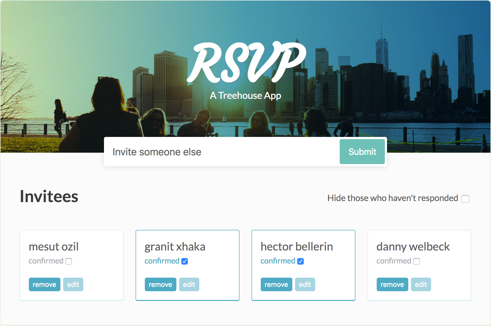

## Party Time RSVP App
***



It's party time! You're planning a party, and you've sent invitations out. Now as the RSVP's come in, you need a way to keep track of who's coming. This is plainly why we built the *Party Time RSVP App*

#### Fire it up on your browser via this link:
***
[Party time RSVP app](https://a-simple-rsvp-app.herokuapp.com/index.html)

Or follow the installation instructions below to run it on your local machine:

## Installation
Clone this repo:
```
$ git clone https://github.com/hmusonye/Project-1-Build-an-RSVP-Web-Application.git
```

Navigate into the app's  directory:
```
$ cd Project-1-Build-an-RSVP-Web-Application
```

Fire up the index.html file on a web browser to start the application.
